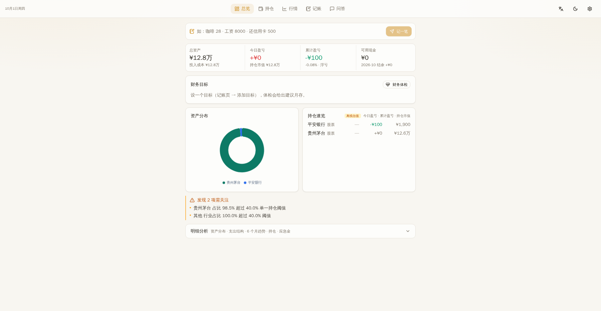
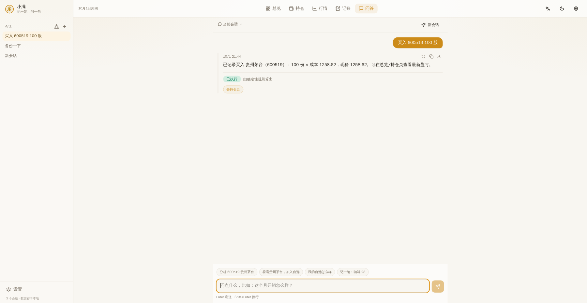
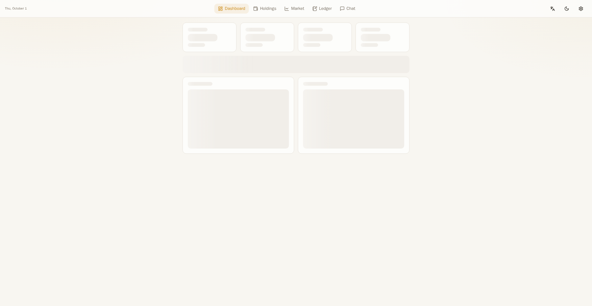

# Xiaoman 小满 · Save a little, grow into plenty

> **One entry, one question** — a conversation-first personal finance assistant. **Local-first × cloud-powered**: your data lives entirely on your own machine, while AI answers and live quotes come from cloud APIs. Open source, free, ready out of the box.


[](README.md)
[](README.en.md)

Xiaoman (小满) is one of the 24 solar terms — the moment when grain is nearly but not yet full. Personal finance works the same way: instead of chasing overnight wealth, save a little every day and let life fill up at its own pace. Xiaoman is not just another expense tracker; it is a **finance assistant that lives in your chat**. Say one sentence, and it records expenses, checks quotes, manages your portfolio, runs a health check, and writes your daily morning report.

**Why you'll like it:**

- 🗣️ **Conversation is the hub** — recording entries, checking quotes, adding watchlists, buying/selling positions, generating morning reports, encrypted backups and changing settings are all done with one sentence in the chat. The other pages are simply views of the conversation results
- 🔒 **100% local data** — every byte of financial data stays in a local SQLite database; no cloud database involved. Optional passphrase-protected encrypted backups (PBKDF2 + Fernet); the passphrase is never stored
- 🇨🇳 **China-first by design** — presets for DeepSeek / Doubao / Qwen / Unisound endpoints; quotes degrade gracefully (Eastmoney → Sina → snapshot) so the app always works
- 🧭 **Built for how investors think** — 5 tabs organized around real mental models (Overview / Holdings / Market / Ledger / Ask AI), red-up/green-down with switchable green-up/red-down
- 🛡️ **Never fabricates numbers** — every amount, P&L and risk metric is computed by a deterministic engine; the model only classifies and writes answers, and at runtime it only sees read-only tools — it can never silently modify your data
- 📱 **Zero-friction setup** — one-click script / single Docker container / installable PWA; empty-state onboarding on first run; fully usable even without an AI key

---

## Screenshots

| Overview (asset mix · top positions · risk flags) | Holdings (concentration · per-position P&L) |
|---|---|
|  |  |

| Chat hub (capability list · one-sentence workflow) | English UI |
|---|---|
|  |  |

---

## Features (5 tabs)

| Tab | What's inside |
|---|---|
| **Overview** | Index strip · asset cards (total / today's P&L / market value / cash) · asset mix · top positions · budget progress (over-budget alerts) · reminder strip (budget / goals / upcoming deductions) · risk banner · health-check entry |
| **Holdings** | Grouped by stock / fund / wealth / cash · concentration & industry risk cards · per-position P&L (red up, green down) · tap a symbol for its K-line |
| **Market** | Watchlist (live quotes & changes, add/remove) · holding quotes · search · per-symbol K-line dialog · quote source & disclaimer footer |
| **Ledger** | One-sentence bookkeeping (rule-fast, questions never mis-recorded) · CSV import · transaction search · manual entry · debts / subscriptions / goals |
| **Ask AI** | Persistent quick chips · true SSE streaming · agent tool loop (steps shown live, auto-degrade on failure) · multi-session · regenerate · in-chat bookkeeping & long-term memory · daily morning report (L1/L2 badges) · source badges |

**One end-to-end workflow**: say "Check Kweichow Moutai and add it to my watchlist if it looks good", then "I bought 100 shares at 1500" — the model orchestrates `search_symbol → get_quote → get_kline → add_to_watchlist → record_position`, from finding the symbol to storing the position, fully automatic; the watchlist, overview and holdings pages update instantly.

## Quick start

Requirements: Python 3.10+; Node.js 20.19+ / 22.12+.

```bash
# Backend (deps in backend/requirements.txt; must start inside backend/)
cd backend
python3 -m venv .venv && .venv/bin/pip install -r requirements.txt
cp .env.example .env          # optional: fill LLM_* to enable a model (see comments for CN endpoints)
.venv/bin/python -m uvicorn app.main:app --host 127.0.0.1 --port 8787

# Frontend: dev mode (HMR, /api proxied to 8787)
cd frontend
npm install && npm run dev    # http://127.0.0.1:5199

# Frontend: production (build once, served by the backend on one port)
cd frontend && npm run build  # then open http://127.0.0.1:8787
```

One-click startup (repo root): `scripts/dev.sh` (backend 8787 + frontend dev 5199). Docker: `docker compose up -d --build` (single container, port 8787, volume `xiaoman-data` persists data and backups).

- **Empty-first**: a fresh database seeds nothing — every page shows chat-style empty-state guidance and a first-run 3-step onboarding (record → watchlist → AI), so what you see is your own real data
- **AI optional**: paste any OpenAI-compatible endpoint in Settings to enable; when unset or failing, the built-in deterministic analysis takes over (badged by source)
- **Backups**: full export/restore in Settings; **set a backup passphrase** for encrypted packages (PBKDF2+Fernet) — shown once, never stored, unrecoverable if lost

## Conversation workflows (examples)

| You say | Xiaoman does |
|---|---|
| "coffee 28, taxi 32" | Multi-entry bookkeeping in one sentence |
| "salary 1w credited" | Records income 10000 (supports 万/w/k and Chinese numerals) |
| "check CATL, add to watchlist if good" | Quote → add to watchlist → visible on Market |
| "buy 100 shares of 600519" | Opens position at current price (asks for cost when quotes unavailable) |
| "sell half of 600519" | Half-position sell, never a full liquidation by accident |
| "remember I pay rent 5000 next month" | Stored to long-term memory, auto-referenced in answers |
| "generate today's morning report / back up now / run a health check" | Report archived / encrypted backup / 5-dimension check |
| "set default home to Holdings" | Changes settings and jumps to Settings |
| "what about last month?" | Continues the previous ledger analysis (read-only, never writes) |

Full guide: [docs/WORKFLOW.en.md](docs/WORKFLOW.en.md) (中文 [docs/WORKFLOW.md](docs/WORKFLOW.md)).

## Tech stack

| Layer | Tech |
|---|---|
| Frontend | React 19 + Vite + Tailwind 4 · ECharts lazy-loaded · PWA (installable) |
| Backend | FastAPI + LangGraph multi-agent orchestration · deterministic analysis engine |
| Data | SQLite (local-first, aiosqlite + WAL) · encrypted backups (PBKDF2 + Fernet) |
| AI | OpenAI-compatible endpoints (DeepSeek / Doubao / Qwen / Unisound presets) · streaming + function calling |
| Quotes | Eastmoney → Sina → local snapshot, 3-level fallback |

## Architecture

```
Frontend (React 5 tabs: Overview / Holdings / Market / Ledger / Ask AI)
  → FastAPI: REST + SSE + static hosting + minimal auth (API_TOKEN)
  → LangGraph orchestration (agent_graph.py): supervisor routes to record/memory/general
      or collect_market → collect_ledger → risk → finalize (sequential edges for single SQLite)
  → Deterministic analysis engine (analysis.py): the only source of truth for numbers
  → Agent tool layer (agent.py + tools.py): function-calling loop, 17 tools;
      at runtime the model only receives read + watchlist tools — writes
      (record/memory/buy-sell/settings/backup/report) are intercepted by deterministic nodes
  → LLM client (llm.py, OpenAI-compatible, CN presets)
  → Data: SQLite (positions/transactions/debts/subscriptions/budgets/settings/goals/memory/watchlist/history)
  → External: quotes with 3-level fallback Eastmoney → Sina → snapshot
```

The framework orchestrates; the engine computes. The model only appears at classification and finalization — any failure degrades to the deterministic path (the service never breaks and never fakes model output).

## Repository layout

```
backend/app/
  main.py       FastAPI: REST + SSE + auth + static hosting + backup/restore/K-line/CSV export
  db.py         Data layer: schema + incremental migrations + all table access
  analysis.py   Deterministic engine: positions/cashflow/debt/emergency fund/concentration/risk
  quotes.py     Quotes: Eastmoney→Sina→snapshot fallback + unified cache registry
  llm.py        Model client: OpenAI-compatible, streaming/JSON
  nlparse.py    One-sentence bookkeeping: rule engine + AI fallback
  csvimport.py  Statement CSV: column mapping & category detection
  tools.py      Agent tool layer: 17 function-calling tools
  agent.py      Agent loop: multi-round LLM function calling
  agent_graph.py LangGraph graph: supervisor + specialized nodes + conditional routes
  service.py    Q&A service: routing/event contract
  scheduler.py  Scheduled morning report: APScheduler
  backup.py     Local encrypted backup: PBKDF2+Fernet, passphrase never stored
frontend/src/
  App.tsx               5-tab layout (top bar on desktop / bottom bar on mobile)
  components/           Dashboard / HoldingsView / MarketView / EntryView / ChatView
                        / SettingsView / IndicesStrip / KlineDialog / MorningReportDialog …
  lib/                  api / store / i18n (zh+en) / charts / format / brand
docs/
  DEPLOY.md / CONFIG.md / WORKFLOW.md   (plus .en versions)
  screenshots/                           product screenshots
```

## API (excerpt)

| Endpoint | Description |
|---|---|
| `GET /api/dashboard` | Full overview payload (single fetch) |
| `POST /api/ask` | SSE streaming Q&A (start/step/agent_step/text/final/done) |
| `GET /api/watchlist` · `POST/DELETE /api/watchlist` | Watchlist: list / add / remove |
| `GET /api/quote` · `GET /api/search` · `GET /api/kline` | Live quote / search / K-line |
| `POST /api/nl-add` | One-sentence bookkeeping (`source: rule\|ai`) |
| `GET/PUT /api/budgets` · `POST/DELETE /api/debts` · `POST/DELETE /api/subscriptions` | Budgets / debts / subscriptions |
| `GET/POST/PUT/DELETE /api/goals` · `GET/POST/DELETE /api/memory` | Goals / long-term memory |
| `GET /api/health-check` | 5-dimension financial health check |
| `GET /api/export?passphrase=` · `POST /api/import/backup` | Backup (passphrase-encrypted) / restore |
| `GET /api/export/csv` · `POST /api/import/csv` | CSV export / statement import |
| `GET /api/reports` · `POST /api/reports/generate` · `GET /api/scheduler` | Report history / generate / scheduler status |
| `GET /api/bootstrap` · `GET/PUT /api/settings` · `GET /api/health` | Bootstrap / settings / health |

**Auth**: when `API_TOKEN` is set, all `/api/*` require `Bearer` or `?token=`; without a token, Host/Origin protection only allows localhost and the `ALLOWED_HOSTS` allowlist.

## Docs & configuration

- [Deployment guide (local / Docker / external access / backup migration)](docs/DEPLOY.en.md) · [中文](docs/DEPLOY.md)
- [Configuration reference (env vars + settings + AI endpoint cheat-sheet)](docs/CONFIG.en.md) · [中文](docs/CONFIG.md)
- [Conversation workflows](docs/WORKFLOW.en.md) · [中文](docs/WORKFLOW.md)
- [Development guide (training: code map + add-tool/setting/route workshops + release flow)](docs/DEVELOPMENT.en.md) · [中文](docs/DEVELOPMENT.md)
- Changelog: [CHANGELOG.md](CHANGELOG.md) (current: v1.0.0)
- Env template: [backend/.env.example](backend/.env.example)

## Tests & checks

```bash
cd backend && .venv/bin/python -m pytest tests -q    # 182 tests: engine/quotes fallback/agent loop/LangGraph graph/API/backup round-trip/goals/memory/health-check/secret scan
cd backend && .venv/bin/python -m ruff check app tests
cd frontend && npm run build                          # tsc + vite build (auto-bumps SW cache version)
```

CI covers backend ruff + pytest and frontend tsc + build.

## Data & privacy

- All personal data lives in local SQLite; quotes use public Eastmoney/Sina endpoints; model calls only go to the endpoint you configured.
- Backups are encrypted when a passphrase is set; plaintext export shows a strong warning. When all quote sources fail, the local snapshot price is used and clearly labeled "offline estimate, not real-time".
- No telemetry, no tracking, no third-party analytics; uninstalling removes everything.

## Disclaimer

Everything this software outputs (health checks, daily reports, AI advisor answers, goal & budget suggestions) is **for reference only and does not constitute investment advice** or any promise of returns. Markets carry risk; invest carefully; you are responsible for your own decisions.

## Open source & contributing

- License: [MIT](LICENSE) · Code of Conduct: [CODE_OF_CONDUCT.md](CODE_OF_CONDUCT.md) · Contributing: [CONTRIBUTING.md](CONTRIBUTING.md) · Security: [SECURITY.md](SECURITY.md) · Changelog: [CHANGELOG.md](CHANGELOG.md)
- Issues, PRs, stars and shares are all welcome. Propose a feature or share your money-saving tips in Issues.

**Topics**: `personal-finance` `finance-assistant` `ai-assistant` `chatbot` `stock` `fund` `portfolio` `budget` `sqlite` `fastapi` `langgraph` `react` `pwa` `local-first` `privacy`

## Changelog

- **v1.0.0 (2026-10, final hardening)** — four full sweeps, 12 fixes: advice sentences no longer mis-booked; 6-digit stock buys no longer recorded as expenses; "add to watchlist" triggers market tools; morning report recursion fixed; "sell half" never liquidates fully; `1w`/`2k` amounts converted correctly; 5th "settings" capability card on first screen; multi-entry bookkeeping in one sentence; omitted follow-ups continue the ledger analysis; **security: the agent only receives read tools at runtime**; "remember…" is stored as memory first. **This round**: settings-tool whitelist (unknown keys rejected); encrypted-backup unit tests (round-trip / wrong passphrase / tampering) and watchlist/half-sell tool tests; **185+ tests green, coverage 75%+**; standalone CHANGELOG, version 1.0.0, CI coverage report, bilingual development guide. Full history in [CHANGELOG.md](CHANGELOG.md).
- **2026-09 (investor-mindset redesign + workflow)** — 5-tab navigation; index strip; holdings page (grouping + concentration risk); market page (watchlist + holdings tabs, search, K-line); red-up/green-down (switchable); 17 agent tools; one-sentence end-to-end workflow; quick chips; overview reminder strip; encrypted local backups (PBKDF2+Fernet); 3-level quote fallback; cleanup pass; empty-first onboarding + empty-state guides + first-run 3-step; conversation hub (action tools + jump links + capability list).
- **2026-09 (goals · memory · checkup)** — financial goals, long-term memory, 5-dimension health check; "remember…" in chat.
- **2026-09 (LangGraph single path)** — LangGraph graph becomes the only execution path; React 19 / Vite 7 / Tailwind 4 modernization.
- **2026-09 (agent upgrade)** — real agent tool loop, subscription add/remove, K-line, backup/restore, passcode dialog, Docker, one-click start.
- **2026-09** — budgets, one-sentence bookkeeping, CSV import, upcoming-deduction reminders, PWA, session search, regenerate, AI Q&A, brand system.
